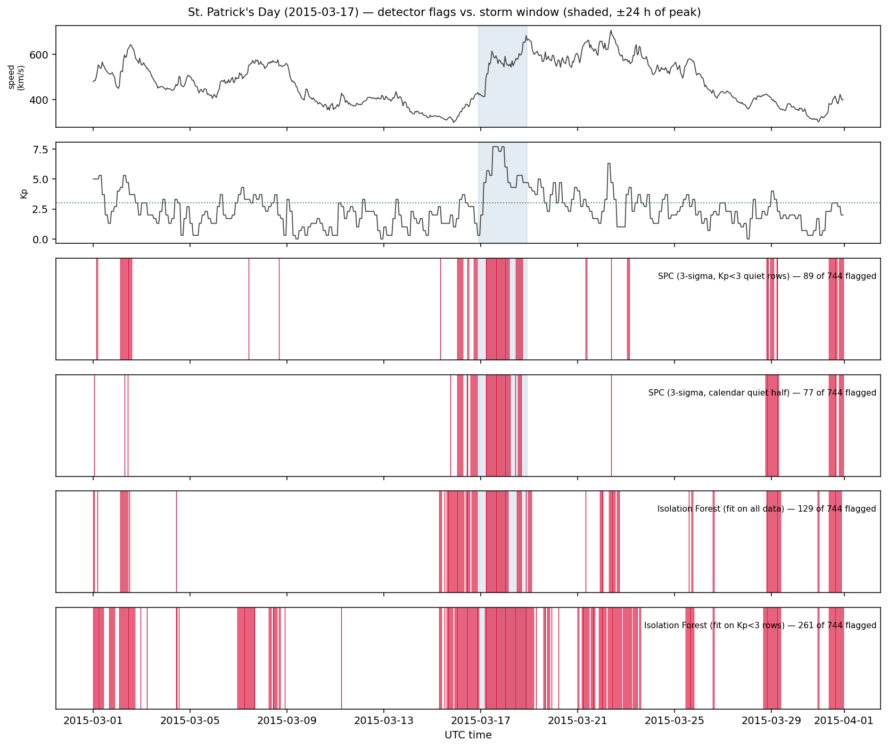

# Results

**Question.** Can an unsupervised detector flag geomagnetic storm conditions in
solar-wind time series cleanly enough to be operationally useful — and does an
ML model beat a plain statistical baseline at it?

**Short answer.** Every configuration detects every storm, so detection is not
the discriminating problem — *restraint* is. On that, the statistical baseline
beats Isolation Forest decisively, and the gap widens exactly where the
problem gets hard.

Reproduce:

```bash
python scripts/compare_detectors.py            # fetches any missing windows
python scripts/compare_detectors.py --offline  # cached windows only
```

---

## 1. Data

Hourly [NASA OMNI2](https://omniweb.gsfc.nasa.gov/) records via OMNIWeb:
`speed` (km/s), `density` (cm⁻³), `temperature` (K), `imf_magnitude` (nT), and
`Kp`. One calendar-month window per catalogued storm — boundaries derived
deterministically from the catalog, so the cache key is identical on every run
and on any machine.

**All five catalogued storms were evaluated: 3,696 hourly samples total.**

| Event | Peak | Kp | Samples | Kp≥3 hours | Kp≥5 hours |
| --- | --- | --- | --- | --- | --- |
| Bastille Day | 2000-07-15 | 9 | 744 | 35.5% | 8.9% |
| Halloween Storms | 2003-10-29 | 9 | 744 | **54.0%** | **17.3%** |
| St. Patrick's Day | 2015-03-17 | 8 | 744 | 35.1% | 6.0% |
| September 2017 | 2017-09-08 | 8 | 720 | 36.7% | 7.5% |
| Gannon Storm | 2024-05-10 | 9 | 744 | 22.2% | 10.1% |

**Ground truth** is `data/storm_catalog.csv`. A detection is a hit if it lands
within **±24 h of the storm peak**.

### Limitations, stated up front

1. **Event recall is saturated and therefore uninformative.** All four
   configurations detected all five storms (recall 1.000). These are the five
   largest storms in two decades and the tolerance is ±24 h, so catching them
   is a low bar that everything clears. **Every conclusion below rests on
   precision and false-alarm rate**, which do discriminate. Recall is reported
   only so its uselessness is visible rather than hidden.

2. **The catalog under-labels reality**, and unevenly. It lists one storm per
   month-long window, but October 2003 has Kp ≥ 5 in 17.3% of its hours —
   sustained storm conditions that our ground truth calls "quiet." Precision
   figures are therefore **lower bounds**, and they are depressed most in the
   most active windows. This is not uniform noise; it biases the comparison in
   a specific direction, discussed in §4.

3. **Kp is 3-hourly, repeated hourly** in OMNI2, so the effective sample size
   of the quiet label is a third of the row count and the false-alarm
   denominator is optimistic.

4. **No lead-time results.** `onset_utc` is blank, so windows centre on *peak*
   and `lead_time_summary` correctly returns all-NaN. The operationally
   decisive metric is still missing. See ROADMAP "Open work" item 1.

5. **Five events cannot support a tight precision estimate.** The per-window
   spread is large (§3), and five points is not enough to put a meaningful
   confidence interval on any of these means.

## 2. Method

Four configurations, identical features, identical ±24 h tolerance, identical
evaluation code path (`src.evaluation.evaluate_detector`), a fresh detector
fitted per window:

| Configuration | Fitted on |
| --- | --- |
| SPC, 3σ | Rows with Kp < 3 |
| SPC, 3σ | First half of the window (calendar) |
| Isolation Forest, 300 trees, `contamination="auto"` | All rows |
| Isolation Forest, 300 trees, `contamination="auto"` | Rows with Kp < 3 |

Both fitting regimes are run for both detectors, because the choice is not
neutral and pairing one regime per detector would let the setup decide the
result. `contamination` stays at `"auto"` deliberately — tuning it to the
observed storm rate would leak test labels into an unsupervised model.

Per-window fitting matters: solar activity varies enormously across a cycle, so
"quiet" in October 2003 is not "quiet" in May 2024. One global baseline across
24 years would be indefensible.

## 3. Results

Means across all five windows (3,696 samples):

| Configuration | Event recall | Precision | PW recall | PW F1 | PW FPR | Quiet FAR | Flagged |
| --- | --- | --- | --- | --- | --- | --- | --- |
| **SPC 3σ, calendar quiet half** | 1.000 † | **0.394** | 0.392 | 0.374 | **0.048** | **0.024** | 262 / 3696 |
| SPC 3σ, Kp<3 quiet rows | 1.000 † | 0.282 | 0.616 | **0.383** | 0.119 | 0.043 | 561 / 3696 |
| Isolation Forest, all data | 1.000 † | 0.254 | 0.494 | 0.333 | 0.101 | 0.061 | 471 / 3696 |
| Isolation Forest, Kp<3 rows | 1.000 † | 0.136 | **0.661** | 0.225 | 0.293 | 0.156 | 1172 / 3696 |

† Saturated — see Limitation 1. Not evidence of anything.

*PW = point-wise. Quiet FAR = fraction of Kp<3 hours flagged.*

**Both SPC configurations beat both Isolation Forest configurations on
precision and on quiet-time false-alarm rate.** There is no metric in this
table on which Isolation Forest wins other than raw recall, and it buys that
recall by flagging up to a third of every month.

### The two SPC configurations answer different questions

Their F1 scores are effectively tied (0.374 vs 0.383) and that tie hides a real
trade-off:

- **Calendar quiet half** — precision 0.394, quiet FAR **2.4%**, 262 flags.
  Conservative. The right choice if false alarms are expensive.
- **Kp<3 quiet rows** — recall 0.616 vs 0.392, at 2× the flags and 1.8× the
  false-alarm rate. The right choice if missing storm hours is expensive.

Quoting F1 alone would erase this. Which one is "best" is a question about the
cost of a false positive versus a missed hour, and that is a domain decision,
not a modelling one.

### Per-window: the spread is large

Point-wise F1 by window:

| Event | SPC calendar | SPC Kp<3 | IF all | IF Kp<3 |
| --- | --- | --- | --- | --- |
| Bastille Day | 0.310 | 0.324 | **0.377** | 0.226 |
| Halloween Storms | **0.343** | 0.307 | 0.133 | 0.062 |
| St. Patrick's Day | **0.476** | 0.449 | 0.326 | 0.284 |
| September 2017 | 0.329 | **0.525** | 0.460 | 0.303 |
| Gannon Storm | **0.410** | 0.311 | 0.369 | 0.252 |

Isolation Forest wins exactly one window (Bastille Day, narrowly). The mean
hides variation of ±0.1 in F1 across windows for every configuration — which
is the strongest argument in this document for **not** trusting any of these
numbers to two decimal places on n=5.



## 4. Why the simple model won — and where it won most

**Halloween 2003 is the informative case.** It is the hardest window for every
detector, and the failure is not uniform: SPC degrades gracefully (F1 0.343 and
0.307) while Isolation Forest collapses (0.133 and **0.062**). Isolation Forest
fitted on quiet rows scores precision **0.039** there — essentially noise.

The mechanism is the interesting part. October 2003 has Kp ≥ 3 in 54% of its
hours; the month is *mostly disturbed*. Isolation Forest has no external notion
of normal — it learns what is typical from the data it is given, so when the
data is mostly storm, storm becomes typical and the model loses the ability to
call it out. SPC is anchored to an explicit quiet reference (Kp < 3, or the
calendar first half), so its notion of normal survives a disturbed month
intact.

**That generalises past this dataset.** An unsupervised model that defines
"anomalous" as "rare in the training data" is fragile precisely when the base
rate shifts — which is exactly when a monitoring system is under most stress.
An explicit reference state is a meaningful robustness advantage, not a
limitation of the older technique.

**The signal shape also favours SPC.** Storm signatures here are dominated by
marginal excursions: speed and IMF magnitude go far outside their quiet range
individually. A per-feature 3σ test is built for that. Isolation Forest's
advantage is detecting unusual *joint* configurations of individually-normal
values, and that capability is close to unused on this data.

**Interpretability is a second, independent win.** SPC reports which feature
drove each detection — in these windows, `speed` and `imf_magnitude`,
consistent with CME-driven storm physics. The forest returns one opaque score.
For alerting, "IMF magnitude is 6σ high" is actionable; "anomaly score 0.71" is
not.

**One caveat against my own conclusion.** Limitation 2 depresses precision most
in the most active windows, and Isolation Forest does worst in exactly those
windows. Some of its Halloween "false positives" are real unlabelled
disturbance. This softens the size of the gap — but not its direction: even on
the quietest window (Gannon, 22% Kp≥3), SPC calendar half leads on precision
0.552 to 0.283.

## 5. What did not work

- **Isolation Forest**, on every aggregate metric. Kept in the repo and
  reported as losing, because deleting it would misrepresent the process.
- **Fitting Isolation Forest on quiet rows only** — the worst configuration
  tested, and instructively so. Learning an artificially narrow "normal" makes
  ordinary variability read as anomalous: 1,172 flags, 32% of all samples, a
  15.6% quiet-time false-alarm rate.
- **The original notebook quiet window (March 1–7 2015)** contains Kp≈5 hours,
  inflating the fitted baseline. Replaced with the calendar first half.
- **Reporting F1 as the summary metric.** It ranks the two SPC configurations
  as near-identical when they differ by 1.6× in recall and 1.8× in false-alarm
  rate. Kept in the table, not used to pick a winner.

## 6. What I would do next

1. **Populate `onset_utc`** so lead time becomes measurable. Without it there
   is no answer to "how much warning would this have given," which is the
   question that decides whether any of this is useful.
2. **Replace the five-event catalog with a Kp≥5-derived event list** over two
   decades. That fixes Limitation 1 (recall saturation — with hundreds of
   smaller events, recall would discriminate again) and Limitation 2
   (under-labelling) simultaneously. Highest-value single change.
3. **Sweep the tolerance** (±6 h to ±48 h) and publish precision/recall as a
   curve rather than one operating point.
4. **Give Isolation Forest the engineered features** — rolling std, rate of
   change, dynamic pressure — that `src/preprocessing.py` already computes but
   the comparison does not use. Interaction structure is likelier there than in
   raw levels, and it is the fairest remaining test of the model class.
5. **Report per-window variance, not just means.** With n=5 and ±0.1 spread in
   F1, the means alone overstate how settled these results are.
